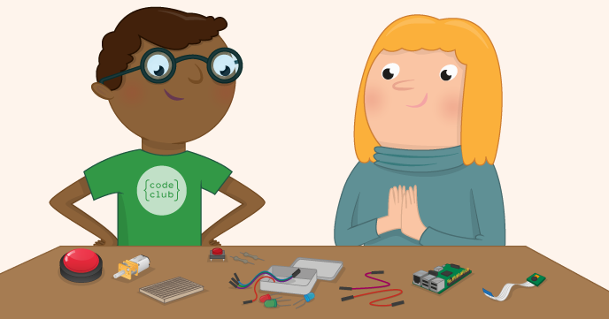

# Getting Started with Physical Computing

One powerful feature of the Raspberry Pi is the row of GPIO pins along the top edge of the board. GPIO stands for General Purpose Input Output. These pins are a physical interface between the Pi and the outside world. At the simplest level, you can think of them as switches that you can turn on or off (input) or that the Pi can turn on or off (output).

It is a way in which the Raspberry Pi can control and monitor the outside world by being connected to electronic circuits. The Pi is able to control LEDs, turning them on or off, or motors, or many other things. It is also able to detect whether a switch has been pressed, or temperature, or light. We refer to this as physical computing.

## Worksheet
- [Worksheet](worksheet.md)

## Licence

Unless otherwise specified, everything in this repository is covered by the following licence:

***Getting Started with Physical Computing*** by the [Raspberry Pi Foundation](http://www.raspberrypi.org) is licenced under a [Creative Commons Attribution 4.0 International License](http://creativecommons.org/licenses/by-sa/4.0/).

Based on a work at https://github.com/raspberrypilearning/physical-computing-guide
