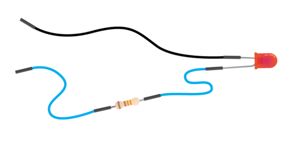

# Connecting an LED without a Breadboard

1.  The LED has a short leg and a long leg. Slot a jumper wire onto the long leg.

1.  Slot the resistor into the other end of the same jumper wire.

1.  Add another jumper wire the other end of the resistor.

1.  Make another jumper wire and slot one end onto the short leg of the LED. You should end up with something that looks like this:

    

    The general purpose input output (GPIO) pins on the Raspberry Pi can communicate with the  outside world and can be controlled or programmed.  Different pins have different roles. To make life easier the pins are numbered for reference.

1. Connect your LED to the 3.3v and ground pins as shown below.

    

1.  Plug in the micro USB power supply and you should see some text appear on your screen.

    Now you have a circuit and the LED should be on. If it is not, make sure that you have plugged the jumper wires into the correct pins by checking the diagram above.

    Why does the LED shine? When the circuit is plugged into the Raspberry Pi GPIO pins, electricity flows through the circuit. The flow is called the current. The LED lights up only when electric current flows from the long leg through the bulb to the short leg. The resistor reduces the amount of electric current passing through the circuit. This protects the LED from breaking, as a high current will make the light shine more brightly and then stop working.

1. Now that you know your LED is working you can connect it to another pin which the Raspberry Pi can switch on and off. Move the wire from the 3.3v pin to any of the GPIO pins coloured yellow on this diagram.

1. In the example below pin 17 has been used, when connected the LED will most likely turn off.

Once you have connected your LED you can control it using a number of programing languages.

|  |     |
| --- | --- |
|  |  |

[Back to getting started with physical computing](worksheet.md)
