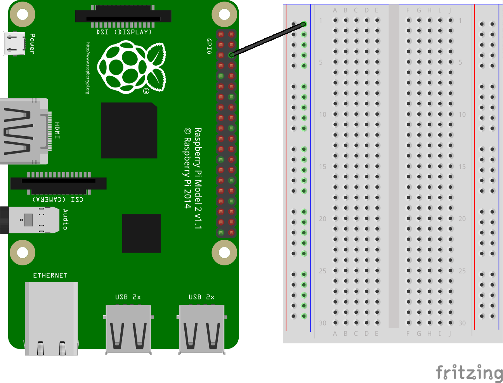
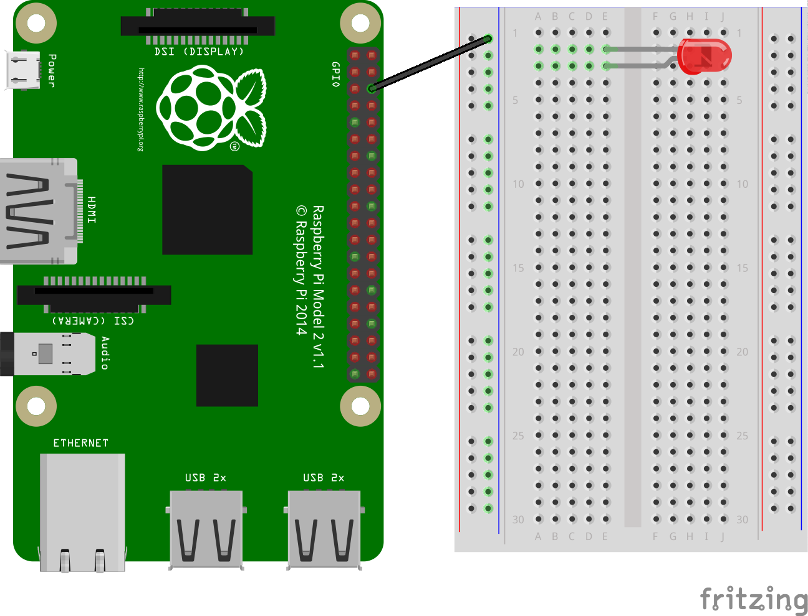
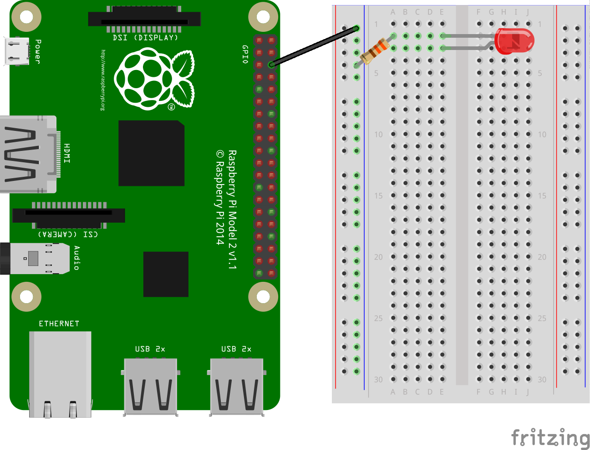
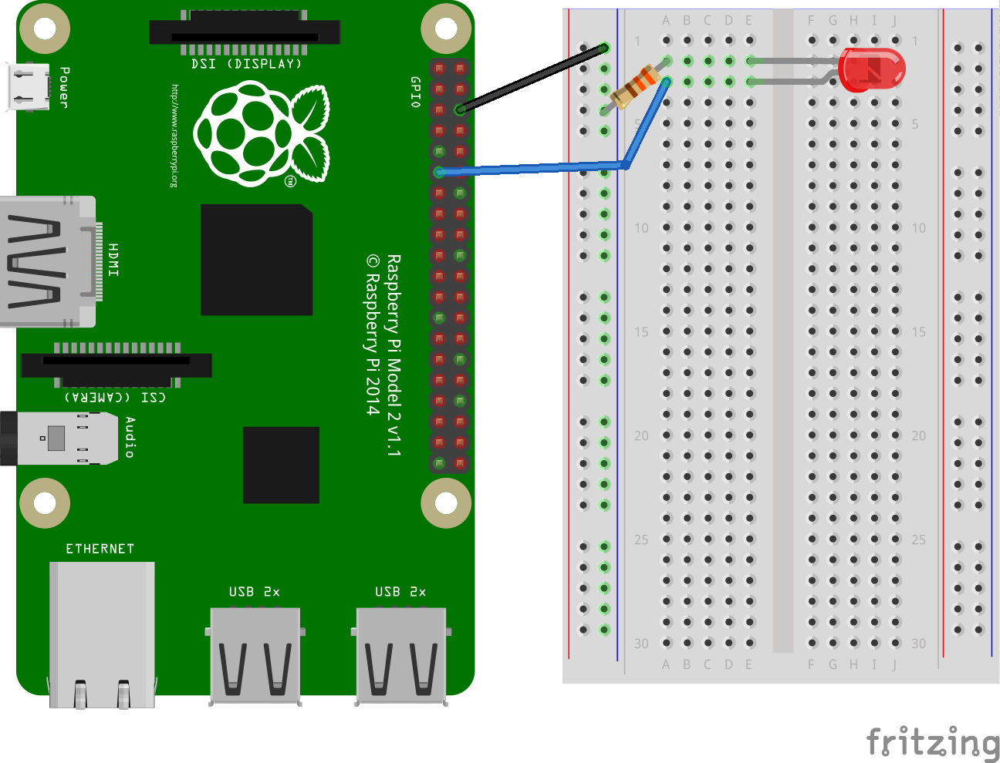
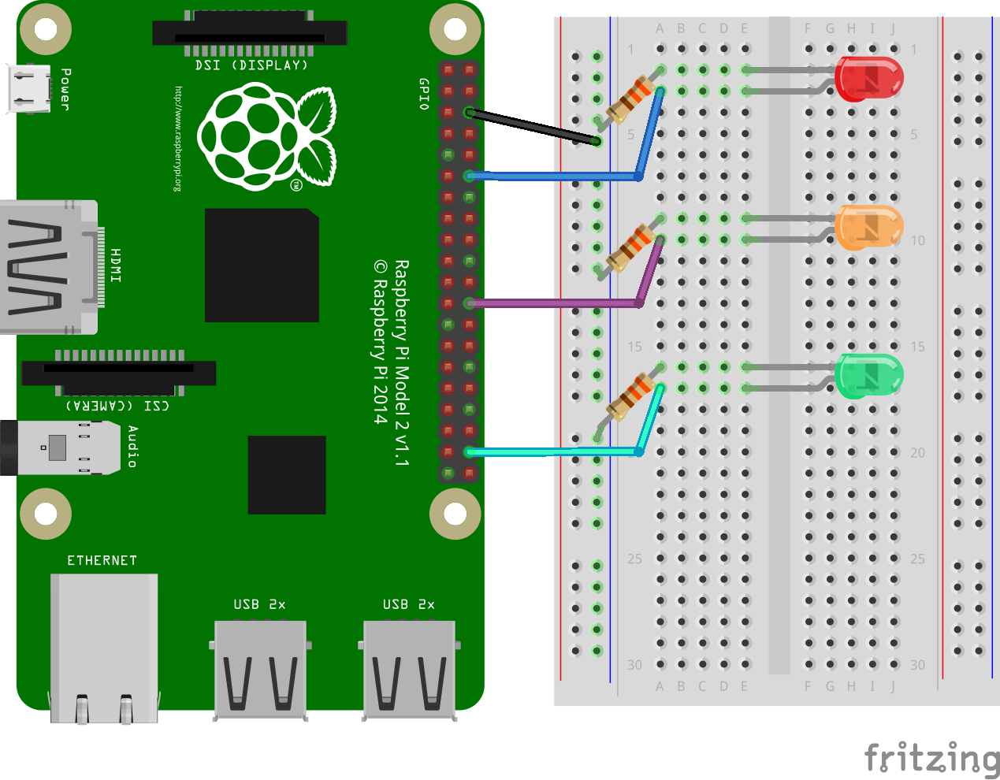

# Connecting and controlling an LED with a Breadboard

In this circuit, you are going to connect your Raspberry Pi to a breadboard to allow you to connect multiple LEDs.

Using a breadboard allows you to connect electronic components to each other without having to solder them together. They are often used to test a circuit design before creating a Printed Circuit Board (PCB). The holes on the breadboard are connected in a pattern. On the breadboard in the CamJam EduKit, the left hand column of holes (marked with red dots) are all connected together, this is the **live**. The second column (marked with blue dots) are also connected together; we call this the **ground** rail. There is another seperate pair of on the other side of the breadboard. In the middle, the holes are connected together in rows of 5 with a break in the middle.

1. Take a female to male jumper wire and connect the female end to a ground GPIO pin on the Raspberry Pi. Push the other end of the jumper wire into a hole on the ground rail on your breadboard like so:

    

1. Now take a red LED and have a look at it. Note that one leg is longer than the other.

1. Push the long leg of the LED into a hole on the 'E' column of the breadboard, e.g. E3, and the shorter leg into a hole next to it on the same column, e.g. E2, like this:

    

1. Locate a 330Ω resistor and connect one leg into a hole on the ground rail and the other leg into a hole on the breadboard that lines up to the shorter leg of your LED, e.g. A2. It does not matter which way around the resistor goes. You will need to bend the legs of the resistor to fit, but make sure that the wires of each leg do not cross each other.

    

1. Now you need to complete the circuit in order for current to flow around it from the Raspberry Pi to light up the LED. To do this you are going to use another jumper wire.

    Take a female to male jumper wire and connect the female end to `GPIO 17` on your Raspberry Pi.  Then push the male end of the jumper wire into a hole on the breadboard that lines up with the longer leg of the LED, e.g. A3.

    

1. Now that you have connected your first LED, adding more only requires another resistor, jumper wire and LED. In the example below three LEDs have been connected using pins 18,8,20.

  

[Back to getting started with physical computing](worksheet.md)
