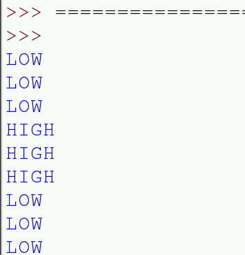
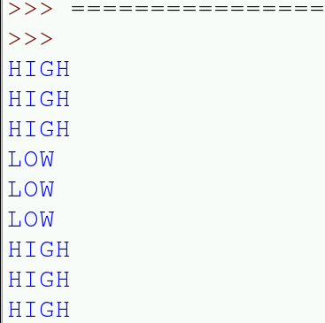

# Pull Up & Pull Down Resistors

When a GPIO pin is in input mode and not connected to 3.3 volts or ground, the pin is said to be **floating**, meaning that it has no fixed voltage level. That's no good for what you want, as the pin will randomly float between `HIGH` and `LOW`. You need to categorically know the state of the pin. So you need to fix the voltage level to `HIGH` or `LOW`, and then make it change **only** when (in the case of this guide) a button is pressed or a pair of wires are manually connected.

This can be done in two ways:

- A pull up circuit

  Wire the GPIO pin to 3.3 volts through a large (10kΩ) resistor so that it always reads `HIGH`. Then we can short the pin to ground by closing the circuit so that the pin will go `LOW`.

  

- A pull down circuit

  Wire the GPIO pin to ground through a large (10kΩ) resistor so that it always reads `LOW`. Then you can short the pin to 3.3 volts by closing the circuit so that it goes `HIGH`. When the circuit is closed, there is a lower resistance path to 3.3 volts, and therefore the pin will read `HIGH`.

  

  Note: The 1kΩ R2 resistor is there in both circuits to give the GPIO pin a fail-safe protection, in case we mistakenly set the pin to be in OUTPUT mode.

### An Analogy
Imagine a gate to a field which has the smoothest hinges ever, the slightest knock, gentle breeze or landing of an insect could move it. You'd never know whether the gate was being opened or closed as it could constantly swing gently between these two positions. If you were to add a spring to the gate to pull it closed, the gate would be held in place, except for a deliberate push which could open it. In this situation the gate's position represents the voltage which can fluctuate, the spring represents the resistor which fixes the voltage either `HIGH` or `LOW`.

Fortunately, the Raspberry Pi has all the above circuitry built in. It can be helpful to imagine that the two resistors `R1` and `R2` from the diagrams above are inside the circuitry of the Raspberry Pi and they can be enabled or disabled as needed. You can select either a pull up or a pull down in your code for each GPIO pin.

### Pull up circuit

In this example you are going to use the internal pull up resistor to make GPIO 4 read `HIGH` by default, then you will short it to ground through the wires so that it will read `LOW` when we press the button or touch the wires together, completing the circuit.

1. Using jumper wires, connect a push button to the Raspberry Pi GPIO pins as shown below. Take care to use the correct pins. If you don't have a push button, you can use two female-to-male jumper wires in order to manually make contact between ground and the input pin.

  

1. Open Idle3 from the main menu.


1. Create a new program from the **File** -> **New Window** option

1. Enter the code below.
  ```python
  import time
  import RPi.GPIO as GPIO
  GPIO.setmode(GPIO.BCM)
  GPIO.setwarnings(False)

  button = 4

  GPIO.setup(pin, GPIO.IN, GPIO.PUD_UP)

  while True:
      button_state = GPIO.input(button)
      if button_state == GPIO.HIGH:
        print ("HIGH")
      else:
        print ("LOW")
      time.sleep(0.5)
  ```

1. Save your program, giving it a sensible name.

1. Run your program by press the **F5** key

1. The text `HIGH` should begin scrolling up the screen. When you press the button (or connect the wires together) for a few seconds you'll see the text `LOW` because you're shorting the pin to ground. Release the button (or disconnect the wires) and it will return to `HIGH` because of the internal pull *up* resistor.

  

1. Press `Ctrl - C` to terminate your Python script at any time.

### Pull down circuit

1. Remove the jumper cables from the Raspberry Pi GPIO pins and reattach them as shown in the diagram below. Take care to use the correct pins.

  

1. The code required to test the pull down circuit is almost identical to that for the pull up so to save time we will just make a copy of your file and change one thing. Click **File** and **Save as** giving your program a new name.

1. Find the `GPIO.setup` line and change the last parameter from `GPIO.PUD_UP` to `GPIO.PUD_DOWN`. This sets the internal pull down resistor on GPIO 4 so that it will read `LOW` unless it's connected to 3.3 volts.

  `GPIO.setup(pin, GPIO.IN, GPIO.PUD_DOWN)`

1. Press the **F5** key to run your new program

1. The text `LOW` should begin scrolling up the screen, when you press the button (or connect the wires together) for a few seconds you'll see the text `HIGH` because you're shorting the pin to 3.3 volts. Release the button (or disconnect the wires) and it will return to `LOW` because of the internal pull *down* resistor.

  

1. Type `Ctrl - C` to terminate your Python script and return to the command line.

[Back to the worksheet](worksheet.md)
