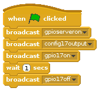

# Testing a connected LED in Scratch

1.  With your LED circuit complete, you are now ready to use Scratch to switch the LED on. Launch the program **Scratch** by clicking on **Menu** followed by **Programming** and selecting **Scratch**.

 

 Our version of Scratch on Raspbian is extra special. It allows you to access and control the GPIO pins.

    

1.  Click on **Control** in the top left display. Drag the  block onto the scripts area.

1. Drag a `broadcast` block to your scripts area and attach it to the  block. Click on the drop down menu on the broadcast block and select **new**.

    In the message name box type `gpioserveron` This instruction will tell the Scratch to activate its GPIO functions.

1. Drag another `broadcast` block to your scripts area and attach it to the bottom. Click on the drop down menu on the broadcast block and select **new**.

    In the message name box type `config17output` This instruction will tell the Raspberry Pi to set GPIO pin 17 as an output.

    

1. Drag another `broadcast` block to your scripts area and attach it to the bottom of first broadcast block. Click on the drop down menu on the broadcast block and select **new**.

    In the message name box type `gpio17on` This instruction will tell the Raspberry Pi to set GPIO pin 17 `HIGH`.

1. Drag a `wait 1 secs` block onto the scripts area and connect it to the previous broadcast block.

1. Drag one last `broadcast` block onto your scripts area and connect it to the `wait 1 secs` block. Click on the drop down menu on the broadcast block and select **new**.

    In the message name box type `gpio17off` This will switch off the LED.

1. Save your work so far by clicking on **File** and **Save As**. Name your file `Test LED` and click **OK**.

1. Test your program by clicking on the  icon. You should see the LED come on for 1 second and then turn off.

    

Back to [Getting started with physical computing](worksheet.md)
