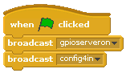
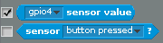

# Test a PIR Montion Sensor in Scratch

1.  With your PIR circuit complete, you are now ready to use Scratch to sense for motion. Launch the program **Scratch** by clicking on **Menu** followed by **Programming** and selecting **Scratch**.

 Our version of Scratch on Raspbian is extra special. It allows you to access and control the GPIO pins.

1.  Click on **control** in the top left display. Drag the  block onto the scripts area.

1. Drag a `broadcast` block to your scripts area and attach it to the  block. Click on the drop down menu on the broadcast block and select **new**.

    In the message name box type `config4in` This instruction will tell the Raspberry Pi to set GPIO pin 4 as an input.

1. Press the green flag in the upper-right corner of the Scratch window. This executes the instruction to set GPIO pin 4 as an input.

1. Scratch uses the 'Sensing' blocks to check if there is any input on the GPIO pins. If there is an input, the value of the pin changes from `0` to `1`. As you connected the PIR sensor to GPIO pin 4 of the Pi, we need to monitor that. Click on the drop-down menu on the `sensor value` block and choose `gpio4`.

1. Tick the check-box to the left of the block to display the pin value on screen.

  

1. Test the PIR sensor by waving your hand in front of it. When it detects movement, the value on the screen should change from `0` to `1`.

1. If the value doesn't change, check that the correct pins are connected.

Back to [Getting started with physical computing](worksheet.md)
