# Getting Started with Physical Computing on the Raspberry Pi

One powerful feature of the Raspberry Pi is the row of GPIO pins along the top edge of the board. GPIO stands for General-Purpose Input/Output. These pins are a physical interface between the Pi and the outside world. At the simplest level, you can think of them as switches that you can turn on or off (input) or that the Pi can turn on or off (output).

The GPIO pins are a way in which the Raspberry Pi can control and monitor the outside world by being connected to electronic circuits. The Pi is able to control LEDs, turning them on or off, or motors, or many other things. It is also able to detect whether a switch has been pressed, or temperature, or light. We refer to this as physical computing.

## GPIO
Models A+, B+ and Pi 2 have 40 pins that look like this:

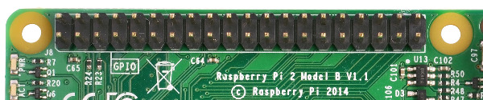

These pins are a physical interface between the Raspberry Pi and the outside world. You can program the Raspberry Pi to switch devices on and off (output), or receive data from sensors and switches (input). Of the 40 pins, 26 are GPIO pins and the others are power or ground pins (plus two ID EEPROM pins which you should not play with unless you know your stuff!)

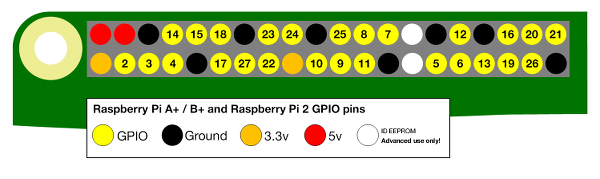

Models A and B have only 26 pins, and look like this:

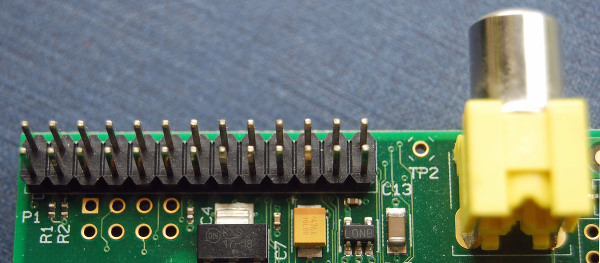

Note that the numbering of the GPIO pins is rather unusual. This is explained in the section on pin numbering, below.

## What are they for? What can I do with them?

You can program the pins to interact in amazing ways with the real world. Inputs don't have to come from a physical switch; it could be input from a sensor or a signal from another computer or device, for example. The output can also do anything, from turning on an LED to sending a signal or data to another device. If the Raspberry Pi is on a network, you can control devices that are attached to it from almost anywhere, and those devices can send data back. Connectivity and control of physical devices over the internet is a powerful and exciting thing, and the Raspberry Pi is ideal for this. There are lots of brilliant examples of physical computing on [our blog](http://www.raspberrypi.org/blog/).

## How the GPIO pins work

### Output

**WARNING**: If you follow the instructions, then messing about with the GPIO is safe and fun. Randomly plugging wires and power sources into your Pi, however, may kill it. Bad things can also happen if you try to connect things to your Pi that use a lot of power; LEDs are fine, motors are not. If you are worried about this, then you might want to consider using an add-on board such as the [Explorer HAT](https://shop.pimoroni.com/products/explorer-hat) until you are confident enough to use the GPIO directly.

Ignoring the Pi for a moment, one of the simplest electrical circuits that you can build is a battery connected to a light source and a switch (the resistor is there to protect the LED):

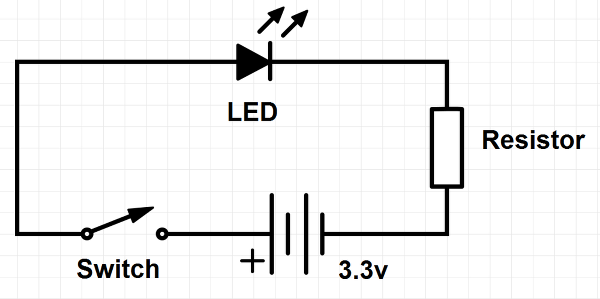

When we use a GPIO pin as an output, the Raspberry Pi replaces both the switch and the battery in the above diagram. Each pin can turn on or off, or go `HIGH` or `LOW` in computing terms. When the pin is `HIGH` it outputs 3.3 volts (3v3); when the pin is `LOW` it is off.

Here's the same circuit using the Raspberry Pi. The LED is connected to a GPIO pin (which can output +3v3) and a ground pin (which is 0v and acts like the negative terminal of the battery):

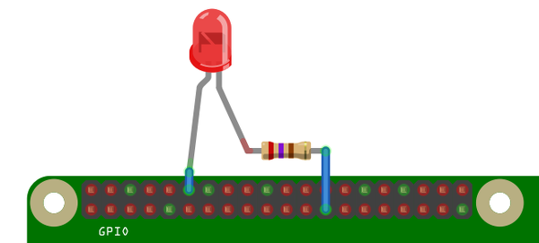

The next step is to write a program to tell the pin to go `HIGH` or `LOW`. Here's an example using [Python](http://www.raspberrypi.org/learning/quick-reaction-game/) (see Step 2), and here's how to do it in [Scratch](http://www.raspberrypi.org/learning/robot-antenna/).

### Input

GPIO *outputs* are easy; they are on or off, `HIGH` or `LOW`, 3v3 or 0v. *Inputs* are a bit trickier because of the way that digital devices work. Although it might seem reasonable just to connect a button across an input pin and a ground pin, the Pi can get confused as to whether the button is on or off. It might work properly, it might not. It's a bit like floating about in deep space; without a reference it would be hard to tell if you were going up or down, or even what up or down meant!

This is why you will see phrases like "pull up" and "pull down" in Raspberry Pi GPIO tutorials. It's a way of giving the input pin a reference so it knows for certain when an input is received.

## GPIO Pin Numbering

When programming the GPIO pins there are two different ways to refer to them: GPIO numbering and physical numbering.

### GPIO numbering

These are the GPIO pins as the computer sees them. The numbers don't make any sense to humans, they jump about all over the place, so there is no easy way to remember them. However, you can use a printed reference or a reference board that fits over the pins to help you out.

### Physical numbering

The other way to refer to the pins is by simply counting across and down from pin 1 at the top left (nearest to the SD card). This is 'physical numbering' and it looks like this:

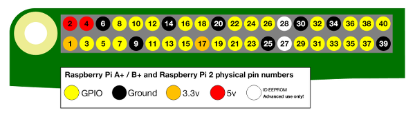

### Which system should I use?

Beginners and young children may find the physical numbering system simpler -- you simply count the pins. You'll still need a diagram like the one above to know which are GPIO pins, which are ground and which are power though.

Generally we recommend using the GPIO numbering. It's good practice and most resources use this system. Take your pick though -- as long as you use the same system within a program then all will be well. Note that pin numbering can also depend on what programming language you are using.

For more details on the advanced capabilities of the GPIO pins see gadgetoid's [interactive pinout diagram](http://pi.gadgetoid.com/pinout).

### Pull Up and Pull Down Resistors
When a GPIO pin is in input mode and not connected to ground or 3v3, the pin is said to be floating, meaning that it has no fixed voltage level. That's no good for what we want, as the pin will randomly float between `HIGH` and `LOW`. We need to categorically know that the wires have touched. So we need to fix the voltage level to `HIGH` or `LOW`, and then make it change only when the we touch the wires together. You can learn more about pull up and pull down resistors in [this guide](pull_up_down.md).

# Components

## What is a breadboard?
You can think of a breadboard as being something like an artist's canvas, but without any of what we create on the canvas being permanent. Whilst it is possible to make a circuit without a breadboard, it keeps components organised rather than being a mess of wires without clear indication of how every wire connects to each other. Secondly, if you were to take a circuit and design it to fit on a PCB, a breadboard allows you to organise components logically before making the design permanent.

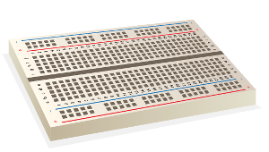

From an electronics perspective, horizontal lines of holes are connected together inside the breadboard by metal connections, with the components inside the holes clipping onto each connection.

Along the sides of the breadboard are power and ground rails - these connect vertically instead of horizontally, and are used to tidy up the circuits by being a union point for any power connections. It's also safer this way, as all power can be disconnected from components by pulling the power source's connection to these rails, rather than pulling the connection to each individual component requiring power.

The name breadboard comes from the the fact that engineers in the past would prototype circuits on bits of wood. Often these bits of wood would be breadboards they'd pinch from the kitchen!

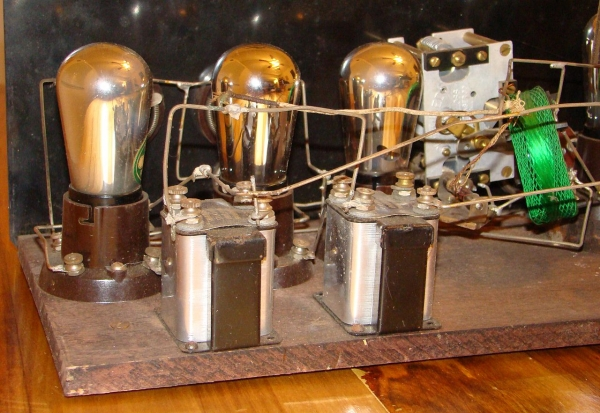

## What is a resistor?

Resistors are a way of limiting the amount of electricity going through a circuit; specifically, they limit the amount of **current** that is allowed to flow. The measure of resistance is called **Ohm (Ω)**, and the larger the resistance, the more it limits the current.

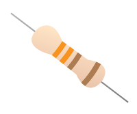

The value of a resistor is marked with coloured bands along the length of the resistor body. A commonly used resistor in LED projects has the resistance value of a 330Ω. You can identify the 330Ω resistors by the colour bands along the body. The colour coding will depend on how many bands are on the resistors supplied: If there are four colour bands, they will be Orange, Orange, Brown, and then Gold. If there are five bands, then the colours will be Orange, Orange, Black, Black, Brown.

You have to use resistors to connect LEDs up to the GPIO pins of the Raspberry Pi. The Raspberry Pi can only supply a small current (about 60mA). The LEDs will want to draw more, and if allowed to they will burn out the Raspberry Pi. Therefore putting the resistors in the circuit will ensure that only this small current will flow and the Pi will not be damaged. It does not matter which way round you connect the resistors. Current flows in both ways through them.

## What is an LED?

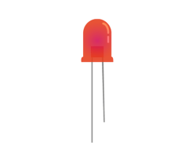

**LED** stands for **Light Emitting Diode**, and glows when electricity is passed through it. When you pick up the LED, you will notice that one leg is longer than the other.The longer leg (known as the **anode**), is always connected to the positive supply of the circuit. The shorter leg (known as the **cathode**) is connected to the negative side of the power supply, known as **ground**. LEDs will only work if power is supplied the correct way round (i.e. if the **polarity** is correct).  You will not break the LEDs if you connect them the wrong way round, they simply will not glow. If you find that they do not light in your circuit, it may be because they have been connected the wrong way round.

**Why does the LED shine?**

When a circuit is plugged into the Raspberry Pi GPIO pins, electricity flows through the circuit. The flow is called the current. The LED lights up only when electric current flows from the long leg through the bulb to the short leg. The resistor reduces the amount of electric current passing through the circuit. This protects the LED from breaking, as a high current will make the light shine more brightly and then stop working.

- [Connecting LEDs without a breadboard](connect-led.md)
- [Connecting an LED with a breadboard](connect-leds.md)
- [Testing a connected LED in Python](test-led-python.md)
- [Testing a connected LED in Scratch](test-led-scratch.md)

## What is a push button?
A push button will complete a circuit when the button is pressed.  What that means is that a current will not flow across the button until it is pressed.  When it is released, the circuit will be ‘broken’.

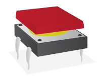

## What is a jumper wire?
Jumper wires are used on breadboards to ‘jump’ from one connection to another. Commonly, jumper wires have different connectors on each end. There are three types of jumper wires:

| | | |
|:-------|---|:---|
| **Male to Male** | 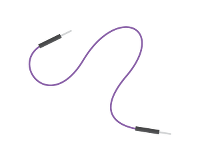 | Both ends have a 'pin' that can be used with breadboards. |
| **Male to Female** | 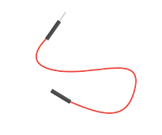 | The end with the ‘pin’ will go into a Breadboard. The end with the piece of plastic with a hole in it will go onto the Raspberry Pis GPIO pins. |
| **Female to female** | 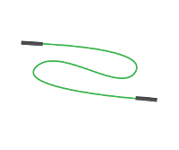 | Both ends have a piece of plastic with a hole in it and can be used with Raspberry Pis GPIO pins and components. |

We use jumper wires to connect to the GPIO pins on the Raspberry Pi and breadboards. It's a really quick and simple way to get started making simple circuits.

## What is a PIR Motion Sensor?
**PIR** stands for **Passive Infra-Red**. It's a type a of sensor that you would most often find in the corners of rooms for burglar alarm systems. All objects whose temperatures are above absolute zero emit infra-red radiation. Infra-red wavelengths are not visible to the human eye, but they can be detected by the electronics inside one of these modules.

The sensor is regarded as passive because it doesn't send out any signal in order to detect movement. It adjusts itself to the infra-red signature of the room it's in and then watches for any changes. Any object moving through the room will disturb the infra-red signature, and will cause a change to be noticed by the PIR module.

We don't need to worry about its inner workings. What we're interested in are the three pins on it; we can connect those to the Raspberry Pi GPIO pins. One pin is for +5 volts, one pin is for ground and the other is the sensor pin (the middle pin on our Pi). This sensor pin will receive power whenever motion is detected by the PIR module. We can then see that happening on the Raspberry Pi and take action accordingly.

- [Connecting a PIR sensor](connect-pir.md)
- [Test a PIR sensor with Python](test-pir-python.md)
- [Test a PIR sensor with Scratch](test-pir-scratch.md)

## What next?

### The start of something amazing
We hope that this has encouraged you to have a go at physical computing using the Pi's GPIO; it's really not as daunting as it looks. It all starts with a simple LED, but it can take you to incredible places. Do not underestimate the fun, creativity and sense of achievement you can get from a little computer and a bunch of pins. Have fun! And if you do make something cool please let us know. 
- Why not use your new found physical computing knowledge to complete one of our [make resources](https://www.raspberrypi.org/resources/make/)?
